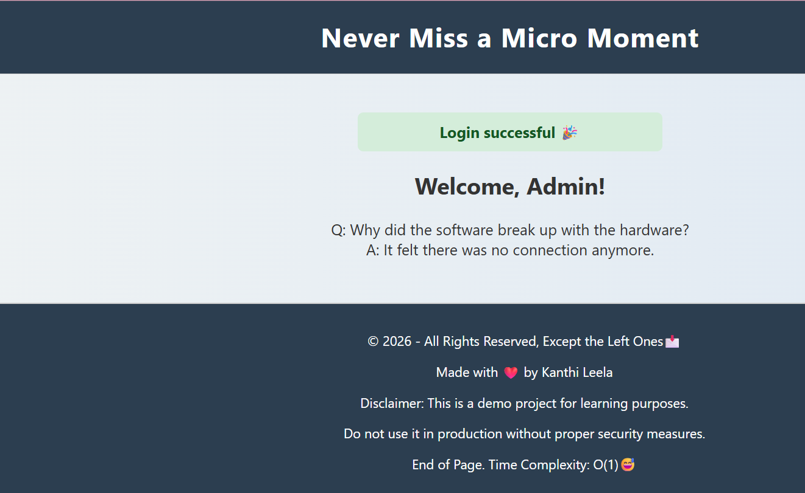

###  Project Overview

<strong>Flow:</strong>

1. User enters email

2. System generates OTP

3. OTP sent to email

4. User enters OTP

5. If correct → login success → Dashboard

### Project Structure
<pre>
otp_email_login_flask/
│
├── app.py
├── config.py
├── requirements.txt
│
├── templates/
│   ├── login.html
│   ├── verify_otp.html
│   └── dashboard.html
│
├── static/
│   ├── css/
│   │   └── style.css
│   └── js/
│       └── script.js
│
├── utils/
│   ├── otp_generator.py
│   └── send_email.py
 </pre>

 ### Output:
  
